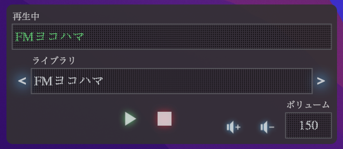

# vlc-controller.widget
Übersicht widget to control VLC running on a remote machine (e.g. Raspberry pi) via HTTP request. This widget allows you to control VLC on a remote machine from your desktop.

## Prerequisites
 - [Übersicht](http://tracesof.net/uebersicht/)

## Getting Started
### 1. Open Widgets folder
 > Select open `Open Widgets folder` from the Übersicht menu in the top menu bar.

### 2. Move the widget to Übersicht widget folder
 > Drag and drop to set in the Übersicht widget folder.

### 3. Configure widget possition
 > Set the server information on which VLC is running. Adjust widget possition as needed.

## Third Party Libraries
This widget incorporates and uses the following libraries.

 - [fast-xml-parser](https://github.com/NaturalIntelligence/fast-xml-parser)
 - [icono](https://github.com/saeedalipoor/icono)
